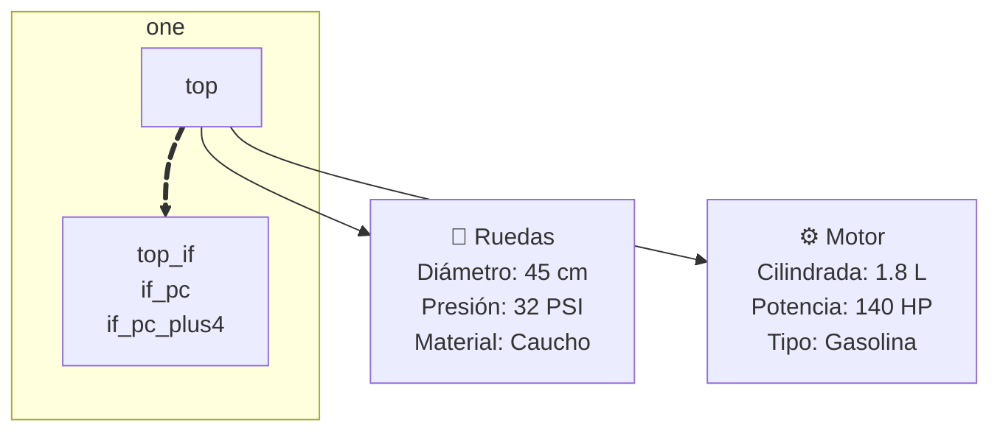
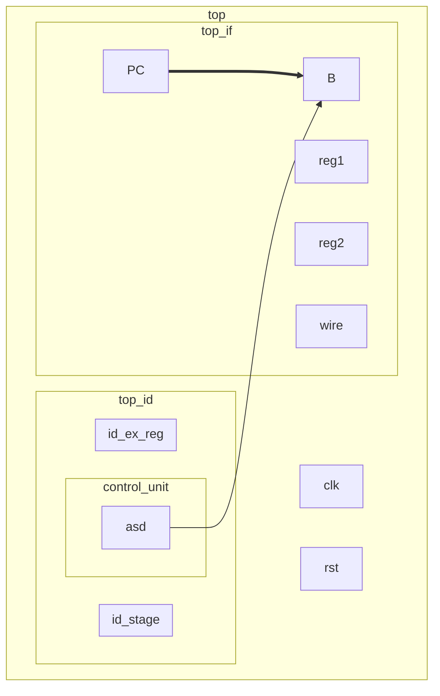

## Resumen del avance del pipeline RISC-V

Este documento resume los cambios implementados y verificados en el procesador pipeline hasta la **Etapa D**, incluyendo mejoras de legibilidad, correcciones funcionales, soporte de nuevas instrucciones, acceso a memoria y manejo de branches.

---

## 1. Limpieza y legibilidad del `top`

Al comenzar la integración del pipeline completo, se realizó una limpieza general del módulo `top` para mejorar la comprensión del datapath y facilitar la depuración.

### Cambios realizados

Se renombraron señales para que reflejen con más claridad:

* la **etapa** a la que pertenecen:

  * `if`
  * `ifid`
  * `id`
  * `idex`
  * `ex`
  * `exmem`
  * `memwb`
  * `wb`

* el **tipo de información** que transportan:

  * `*_data`
  * `*_idx`
  * `*_result`
  * `*_imm`
  * `*_funct3`

* el **tipo de control**:

  * `reg_write`
  * `mem_read`
  * `mem_write`
  * `mem_to_reg`
  * `alu_src`
  * `branch`
  * `jump`

### Efecto

Esto permitió:

* entender mejor el flujo entre etapas
* detectar errores de conexión más rápido
* hacer más legible el testbench y los mensajes de debug
* separar con claridad datos, control y señales auxiliares de forwarding / hazard

---

## 2. Corrección del caso `WB -> ID` en el banco de registros

### Problema detectado

Se detectó un fallo en un caso como:

```asm
addi x1, x0, 5
addi x2, x0, 10
add  x3, x1, x2
sub  x4, x3, x1
```

La instrucción:

```asm
sub x4, x3, x1
```

podía leer un valor viejo de `x1`, porque `x1` estaba siendo escrito en `WB` al mismo tiempo que la etapa `ID` intentaba leerlo desde el `regfile`.

### Solución implementada

Se modificó `regfile32` para que tenga comportamiento **write-first**:

* si `we = 1`
* y `waddr == raddr1` o `waddr == raddr2`
* entonces la salida de lectura devuelve directamente `wdata`

### Efecto

Esto resolvió correctamente los casos en que:

* una instrucción escribe un registro en `WB`
* y otra instrucción lo lee en el mismo ciclo desde `ID`

Con esto se evitó depender de forwarding para un caso que en realidad corresponde al comportamiento del banco de registros.

---

## 3. Etapa A completada

La **Etapa A** estuvo enfocada en verificar el camino base del pipeline para instrucciones aritmético-lógicas simples.

### Instrucciones verificadas

* `ADDI`
* `ADD`
* `SUB`
* `ANDI`
* `AND`
* `ORI`
* `OR`
* `XORI`
* `XOR`
* `SRL`
* `SRA`

### Cambios y verificaciones realizadas

Se implementó y verificó:

* propagación correcta de operandos por el pipeline
* forwarding hacia la ALU
* escritura correcta en `WB`
* funcionamiento del `wb_mux`
* transporte correcto en los registros:

  * `IF/ID`
  * `ID/EX`
  * `EX/MEM`
  * `MEM/WB`

### Validación

El testbench incluyó:

* chequeo funcional de ALU en `EX` usando una referencia (`alu_ref`)
* scoreboard de writes esperados en `WB`
* chequeo del contenido de los latches entre etapas
* trazas por ciclo mostrando:

  * PC
  * instrucción
  * resultado de ALU
  * registros destino
  * señales de forwarding

### Resultado

La Etapa A quedó validada funcionalmente.

---

## 4. Etapa B completada

La **Etapa B** extendió el soporte a instrucciones de comparación, desplazamiento lógico/arimético adicional y carga inmediata superior.

### Instrucciones agregadas

* `SLL`
* `SLT`
* `SLTU`
* `SLTI`
* `SLTIU`
* `LUI`

### Cambios realizados

#### En `alu32`

Se agregaron operaciones para:

* shift left lógico (`SLL`)
* comparación signed (`SLT`)
* comparación unsigned (`SLTU`)
* carga inmediata superior (`LUI`)

#### En `rv_decoder`

Se amplió la decodificación para reconocer estas instrucciones y generar el `alu_op` correcto.

#### En `immgen`

Se agregó soporte para inmediato tipo `U`, necesario para `LUI`.

#### En `control_unit`

Se ajustó la lógica de control para que `LUI` use correctamente:

* writeback al registro
* inmediato tipo `U`
* camino de ALU adecuado

### Validación

Se agregaron nuevos casos al programa de prueba y al scoreboard del testbench.

### Resultado

La Etapa B quedó verificada correctamente junto con la Etapa A.

---

## 5. Etapa C1 completada: `LW` y `SW`

La **Etapa C1** introdujo acceso a memoria por palabra completa.

### Instrucciones agregadas

* `LW`
* `SW`

### Problema detectado

Para las cargas (`LW`), el dato leído desde memoria debía llegar de forma estable a `WB`.

Con la estructura anterior, el camino de memoria podía quedar temporalmente desalineado respecto al resto del pipeline.

### Cambios realizados

#### En `mem_wb_reg`

Se agregó el transporte explícito de:

* `mem_rdata`

de modo que el valor leído desde memoria quedara registrado y disponible en el ciclo correcto.

#### En `wb_mux`

Se modificó para seleccionar entre:

* `memwb_alu_result`
* `memwb_mem_rdata`

según `MemToReg`.

#### En `data_mem`

Se reorganizó la memoria de datos para usar:

* **escritura sincrónica**
* **lectura combinacional**

Esto simplificó la integración con el pipeline y permitió que `LW` funcionara correctamente en el esquema actual.

### Validación

Se probaron casos como:

```asm
sw x29, 0(x28)
lw x30, 0(x28)
sw x29, 4(x28)
lw x31, 4(x28)
```

Además, el testbench agregó verificación explícita de stores en MEM.

### Resultado

La Etapa C1 quedó validada para `LW` y `SW`.

---

## 6. Etapa C2 completada: `SB` y `SH`

La **Etapa C2** extendió el soporte de stores a escrituras parciales.

### Instrucciones agregadas

* `SB`
* `SH`

### Objetivo

Permitir que una instrucción store no escriba necesariamente los 32 bits completos, sino:

* 1 byte (`SB`)
* 2 bytes (`SH`)
* 4 bytes (`SW`)

### Cambios realizados

#### En `top`

Se agregó lógica combinacional para construir:

* `mem_write_data`
* `mem_byte_enable`

a partir de:

* `exmem_rs2_forwarded`
* `exmem_funct3`
* `mem_addr[1:0]`

#### Lógica implementada

* Para `SB`:

  * se coloca el byte en el lane correspondiente según `addr[1:0]`
  * se activa un único bit de `byte_enable`

* Para `SH`:

  * se habilitan dos byte lanes
  * se acomoda el halfword según `addr[1:0]`
  * si la dirección está mal alineada, no se habilita ningún byte lane

* Para `SW`:

  * se mantiene `byte_enable = 4'b1111`

#### En `data_mem`

La memoria ya soportaba escritura por máscara de bytes, por lo que no fue necesario rediseñarla por completo.
Se mantuvo la escritura por palabra, pero usando `byte_en` para decidir qué bytes actualizar.

### Ajuste importante en el testbench

Para `SB` y `SH`, el bus de escritura completo de 32 bits ya no era una referencia válida por sí solo, porque solo importan los bytes habilitados.

Por eso, el testbench pasó a comparar:

* dirección
* `byte_enable`
* datos enmascarados por `byte_enable`

y no el bus completo sin máscara.

### Resultado

La Etapa C2 quedó validada para `SB` y `SH`.

---

## 7. Etapa C3 completada: `LB`, `LH`, `LBU`, `LHU`

La **Etapa C3** extendió el soporte de cargas parciales.

### Instrucciones agregadas

* `LB`
* `LH`
* `LBU`
* `LHU`

### Objetivo

Permitir que una carga desde memoria lea:

* 1 byte con sign-extension (`LB`)
* 2 bytes con sign-extension (`LH`)
* 1 byte con zero-extension (`LBU`)
* 2 bytes con zero-extension (`LHU`)

### Cambios realizados

#### En `top`

Se agregó lógica combinacional para construir:

* `mem_load_data`

a partir de:

* `dmem_read_data`
* `exmem_funct3`
* `mem_addr[1:0]`

#### Comportamiento implementado

* `LB`:

  * selecciona el byte correspondiente
  * realiza sign-extension a 32 bits

* `LBU`:

  * selecciona el byte correspondiente
  * realiza zero-extension

* `LH`:

  * selecciona halfword bajo o alto
  * realiza sign-extension
  * si la dirección está mal alineada, devuelve `0`

* `LHU`:

  * selecciona halfword bajo o alto
  * realiza zero-extension

* `LW`:

  * mantiene el comportamiento anterior, devolviendo la palabra completa

#### En `mem_wb_reg`

Se pasó a registrar `mem_load_data` en lugar del valor crudo `dmem_read_data`.

### Validación

Se reutilizaron datos escritos por `SB` y `SH` para verificar que las cargas parciales leyeran correctamente:

* byte correcto
* halfword correcto
* extensión signed/unsigned correcta

### Resultado

La Etapa C3 quedó validada para cargas parciales.

---

## 8. Etapa D completada: `BEQ` y `BNE`

La **Etapa D** incorporó branches condicionales con resolución temprana en `ID`.

### Instrucciones agregadas

* `BEQ`
* `BNE`

### Estrategia adoptada

Se decidió implementar:

* cálculo de target en `ID`
* comparación en `ID`
* política de control:

  * **predict not taken**

No se implementó predictor dinámico de 1 bit, 2 bits ni tournament predictor en esta etapa.

### Motivo de esta decisión

El objetivo principal de la Etapa D fue resolver correctamente:

* target de branch
* decisión de branch
* hazards asociados
* flush del pipeline

antes de sumar complejidad extra de predicción dinámica.

---

## 9. Cálculo del target del branch en `ID`

### Cambio realizado

Se agregó lógica para calcular en `ID`:

```text
branch_target = ifid_pc + id_imm
```

Esto permitió decidir antes el destino del salto, sin esperar a `EX`.

### Requisito asociado

Para esto fue necesario asegurar que `immgen` generara correctamente el inmediato tipo `B`.

---

## 10. Decisión del branch en `ID`

### Cambio realizado

Se implementó la comparación del branch directamente en `ID`, usando:

* `branch_cmp_a`
* `branch_cmp_b`

La decisión final se calculó según `funct3`:

* `BEQ`: branch tomado si `rs1 == rs2`
* `BNE`: branch tomado si `rs1 != rs2`

### Señales agregadas

* `branch_eq_id`
* `branch_taken_id`
* `branch_target_id`
* `ifid_is_branch`

---

## 11. Forwarding para branches en `ID`

Mover la decisión del branch a `ID` obligó a agregar forwarding específico para el comparador de branches.

### Problema

Los operandos del branch pueden depender de resultados todavía en el pipeline, por ejemplo:

```asm
add x1, x2, x3
beq x1, x4, L
```

En ese caso, el valor correcto de `x1` todavía no está escrito en el banco de registros cuando el branch está en `ID`.

### Solución implementada

Se agregaron caminos de forwarding al comparador de branch desde:

* `EX/MEM`
* `MEM/WB`

con prioridad para `EX/MEM`.

### Restricción importante

No se forwardea un valor de load desde `EX/MEM`, porque en esa etapa el dato de memoria todavía no está disponible como valor final.
Esos casos se resuelven mediante stalls.

---

## 12. Extensión de la `hazard_unit`

La unidad de hazards existente originalmente detectaba solo el caso clásico de:

* `load-use`

### Nuevo alcance

Se extendió para detectar también hazards de branches resueltos en `ID`.

### Casos cubiertos

#### 1. `load-use` clásico

Ejemplo:

```asm
lw  x1, 0(x2)
add x3, x1, x4
```

#### 2. Branch dependiente de resultado en EX

Ejemplo:

```asm
add x1, x2, x3
beq x1, x4, L
```

Requiere **1 stall**.

#### 3. Branch dependiente de load

Ejemplo:

```asm
lw  x1, 0(x2)
beq x1, x4, L
```

Requiere **2 stalls**.

### Salidas utilizadas

La `hazard_unit` genera:

* `stall_if`
* `stall_id`
* `flush_idex`

### Efecto

Con esto se logró que los branches en `ID` comparen operandos correctos sin violar dependencias de datos.

---

## 13. Flush por branch tomado

Como el branch ahora se resuelve en `ID`, cuando resulta tomado solo hay una instrucción incorrectamente traída: la que estaba entrando desde `IF`.

### Solución implementada

Se agregó:

* `flush_ifid = branch_taken_id`

para transformar la instrucción recién fetcheada en NOP.

Además:

* `flush_idex = flush_idex_hazard | branch_taken_id`

para mantener consistente la inserción de burbujas cuando corresponde.

### Beneficio

Esto reduce la penalidad del branch tomado a **una sola instrucción**, consistente con el enfoque del libro.

---

## 14. Integración del control de PC

En `if_stage` se pasó a usar:

* `pc_write_en = ~stall_if`
* `pc_next_external = branch_target_id`
* `pc_sel_external = branch_taken_id`

### Resultado

* si no hay branch tomado, el pipeline sigue por `PC + 4`
* si el branch se toma, el próximo fetch se redirige al target calculado en `ID`

---

## 15. Validación específica de la Etapa D

Se construyó un testbench dedicado para branches, separado del testbench general, para verificar de manera aislada:

* `BEQ` tomado
* `BEQ` no tomado
* `BNE` tomado
* `BNE` no tomado
* branch dependiente de resultado ALU inmediato
* branch dependiente de load inmediato
* flush correcto de instrucciones incorrectas
* cantidad esperada de stalls
* cantidad esperada de branches tomados

### Observación importante

Durante la validación se comprobó que los stalls no dependen de si el branch termina siendo tomado o no, sino de si los operandos correctos están disponibles en el momento en que el comparador de branch los necesita en `ID`.

Por eso, también hubo stalls en branches no tomados cuando existía dependencia real de datos.

### Resultado

La Etapa D quedó validada funcionalmente para `BEQ` y `BNE`.

---

# Etapa E completada: `JAL`, `JALR` (y pseudoinstrucciones `J`, `JR`)

La **Etapa E** incorporó soporte para instrucciones de salto incondicional y completó el conjunto de instrucciones pedidas para el TP.

## Instrucciones implementadas

### Instrucciones reales de RISC-V

* `JAL`
* `JALR`

### Pseudoinstrucciones cubiertas por equivalencia

* `J  = JAL x0, target`
* `JR = JALR x0, rs1, 0`

Esto significa que implementando correctamente `JAL` y `JALR`, también quedan cubiertos `J` y `JR` sin hardware adicional específico.

---

## Objetivo de la etapa

Agregar soporte para saltos incondicionales que:

* redirigen el `PC`
* escriben `rd = PC + 4` en el banco de registros
* se resuelven tempranamente en `ID`
* conviven correctamente con stalls, forwarding y flush del pipeline

---

## Estrategia adoptada

Se mantuvo la misma filosofía usada en la Etapa D para branches:

* resolución del cambio de control en **ID**
* redirección temprana del `PC`
* manejo explícito de hazards
* flush de la instrucción mal fetcheada
* transporte del valor arquitectónico correcto hasta `WB`

La diferencia importante respecto a `BEQ/BNE` es que `JAL` y `JALR` **sí producen un resultado arquitectónico**:

```text
rd = PC + 4
```

Por eso, a diferencia de un branch, la instrucción jump **no puede convertirse en burbuja**, sino que debe seguir viva en el pipeline hasta llegar a `WB`.

---

## Cambios realizados

## 1. Soporte de inmediatos en `immgen`

### `JAL`

Se agregó soporte para inmediato tipo **J**, reconstruyendo correctamente el desplazamiento desde el formato codificado de la instrucción.

### `JALR`

No requirió formato nuevo, porque usa inmediato tipo **I**, que ya existía.

### Resultado

Ahora `immgen` puede generar correctamente:

* inmediatos tipo `I`
* tipo `S`
* tipo `B`
* tipo `U`
* tipo `J`

---

## 2. Extensión de `control_unit`

Se agregó reconocimiento explícito de:

* `JAL`
* `JALR`

### Señales generadas

Para ambos casos se configuró:

* `RegWrite = 1`
* `Jump = 1`

y se desactivaron las señales de memoria y branch condicional.

### Resultado

La instrucción queda identificada como salto, pero además conserva la capacidad de escribir un resultado en `WB`.

---

## 3. Detección temprana de jumps en ID

En `top` se agregaron señales para detectar si la instrucción actualmente presente en `IF/ID` es:

* `ifid_is_jal`
* `ifid_is_jalr`
* `ifid_is_jump`

Esto permite que la etapa `ID` decida si corresponde redirigir el `PC` sin esperar a `EX`.

---

## 4. Cálculo del target del salto en ID

### Para `JAL`

El target se calcula como:

```text
target = PC + imm_J
```

usando:

* `ifid_pc`
* `id_imm`

### Para `JALR`

El target se calcula como:

```text
target = (rs1 + imm_I) & ~1
```

El forzado del bit menos significativo a cero sigue la especificación de RISC-V para `JALR`.

### Resultado

Tanto `JAL` como `JALR` redirigen el `PC` en la etapa `ID`.

---

## 5. Soporte de forwarding para `JALR` en ID

A diferencia de `JAL`, `JALR` depende de un operando de registro (`rs1`) para calcular el target.

### Problema

Cuando `JALR` llega a `ID`, el valor de `rs1` puede estar siendo producido todavía por una instrucción anterior en el pipeline.

Ejemplos:

```asm
add  x5, x1, x2
jalr x7, x5, 0
```

```asm
lw   x5, 0(x10)
jalr x7, x5, 0
```

### Solución

Se agregaron caminos de forwarding hacia `ID` para la base de `JALR` desde:

* `EX/MEM`
* `MEM/WB`

### Restricción importante

No se forwardea un load desde `EX/MEM`, porque en esa etapa el dato final leído de memoria todavía no está disponible.

### Resultado

`jalr_base_id` representa el valor correcto y actualizado de `rs1` usado para calcular el target de `JALR`.

---

## 6. Extensión de la `hazard_unit` para `JALR`

Se amplió la unidad de hazards para detectar dependencias específicas de `JALR`, ya que la base del salto se usa en `ID`.

### Casos cubiertos

#### `ALU -> JALR`

Ejemplo:

```asm
add  x5, x1, x2
jalr x7, x5, 0
```

Requiere **1 stall**, porque el resultado todavía está en EX cuando `JALR` necesita usarlo en ID.

#### `LW -> JALR`

Ejemplo:

```asm
lw   x5, 0(x10)
jalr x7, x5, 0
```

Requiere **2 stalls**, porque el valor del load recién queda disponible después de MEM/WB.

### Resultado

La `hazard_unit` quedó preparada para manejar:

* `load-use`
* branch en ID dependiente de resultados previos
* `JALR` en ID dependiente de resultados previos

---

## 7. Redirección del `PC`

Se agregó una lógica unificada de redirección en `ID`.

### Señales principales

* `jump_taken_id`
* `redirect_taken_id`
* `redirect_target_id`

### Comportamiento

* si hay branch tomado, se redirige al target del branch
* si hay jump válido, se redirige al target del jump
* si no hay control hazard, el `PC` sigue con `PC + 4`

### Integración con `if_stage`

El `if_stage` pasó a usar:

* `pc_write_en = ~stall_if`
* `pc_sel_external = redirect_taken_id`
* `pc_next_external = redirect_target_id`

---

## 8. Flush del pipeline

### `flush_ifid`

Se activa cuando hay redirección del `PC`:

```text
flush_ifid = redirect_taken_id
```

Esto anula la instrucción mal fetcheada que estaba entrando desde `IF`.

### `flush_idex`

Se mantiene para:

* hazards
* branch tomado

pero **no** para `JAL/JALR`.

### Motivo

`JAL` y `JALR` deben seguir avanzando por el pipeline porque necesitan llegar a `WB` para escribir `rd = PC + 4`.

### Resultado

Los jumps corrigen el flujo de control sin destruir la propia instrucción de salto.

---

## 9. Transporte de `PC + 4` por pipeline

Para soportar el writeback de `JAL/JALR`, se agregó transporte explícito de `PC + 4` por las etapas intermedias:

* `ID/EX`
* `EX/MEM`
* `MEM/WB`

### Nuevas señales

* `ex_pc_plus4`
* `exmem_pc_plus4`
* `memwb_pc_plus4`

---

## 10. Soporte de writeback para jumps

Hasta la Etapa D, `WB` elegía entre:

* resultado de ALU
* dato leído de memoria

Pero `JAL/JALR` agregan una tercera fuente de resultado:

```text
PC + 4
```

### Solución adoptada

Se extendió `wb_mux` para que, si la instrucción es jump, escriba:

```text
wb_wdata = pc_plus4
```

### Resultado

Ahora el writeback soporta correctamente:

* ALU result
* MEM read data
* `PC + 4`

---

## 11. Forwarding correcto del resultado arquitectónico de jumps

Para instrucciones normales, el valor que se forwardea desde `EX/MEM` es el resultado de ALU.

Pero para `JAL/JALR`, el valor arquitectónico real no es el resultado de ALU, sino:

```text
PC + 4
```

### Solución

Se agregó `exmem_forward_value`, que selecciona:

* `exmem_pc_plus4` si la instrucción en `EX/MEM` es un jump
* `exmem_alu_result` en el resto de los casos

### Resultado

Las instrucciones posteriores pueden consumir correctamente el resultado de un `JAL/JALR` sin esperar a que se escriba en el register file.

---

## 12. Validación de la etapa

Se construyó un testbench específico para la Etapa E, separado de los testbenches anteriores, para validar de forma dirigida:

* `JAL`
* `J`
* `JALR`
* `JR`
* `ALU -> JALR` con 1 stall
* `LW -> JALR` con 2 stalls
* writeback correcto de `PC + 4`
* flush correcto de la instrucción siguiente al salto

### Observación importante

Durante la validación se comprobó que:

* `JAL` y `J` funcionan sin dependencias de operandos
* `JALR` necesita forwarding y hazard detection correctos
* la redirección del `PC` ocurre al resolverse el salto en `ID`
* el nuevo `PC` se ve reflejado en `IF` en el ciclo siguiente
* las instrucciones mal fetcheadas efectivamente no llegan a modificar el estado arquitectónico


## 16. Estado actual del procesador

Hasta este punto, el pipeline soporta correctamente:

### Etapa A

* `ADDI`
* `ADD`
* `SUB`
* `ANDI`
* `AND`
* `ORI`
* `OR`
* `XORI`
* `XOR`
* `SRL`
* `SRA`

### Etapa B

* `SLL`
* `SLT`
* `SLTU`
* `SLTI`
* `SLTIU`
* `LUI`

### Etapa C1

* `LW`
* `SW`

### Etapa C2

* `SB`
* `SH`

### Etapa C3

* `LB`
* `LH`
* `LBU`
* `LHU`

### Etapa D

* `BEQ`
* `BNE`

### Etapa E

* `JAL`
* `JALR`

### Pseudoinstrucciones cubiertas

* `J`
* `JR`

